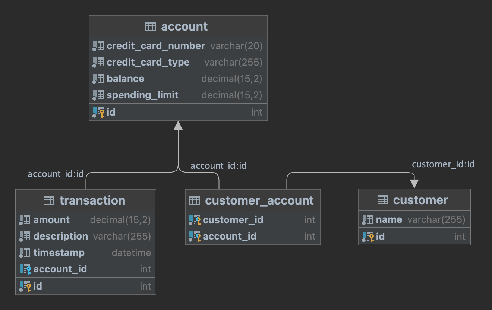

# MoneyTrackr

### Instructions
Please implement a basic REST service and front end in a technology of your choice. The actions should include creating new objects and relationships, as well as updating existing objects (retaining object version history is optional).

Please prepare a presentation on your implementation; this can include a demo, code walkthrough, Powerpoint presentation or other visual aids.

* The data structure is as follows:
* Customer object
* Account object
* Transaction object
* Multiple customers to multiple accounts relationship
* One account to one transaction relationship

The number and types of attributes for each object are up to you.

### Solution
#### Technologies used
* Docker Compose
  * MySQL 8
  * Flyway 10
* Springboot 3
  * Java 17
  * Hibernate 6
  * JPA 2
  * JDBC 6
* Angular 18
  * Material Design 3
  * chart.js 4
  * ng-charts 4
  * axios

#### Database Design
